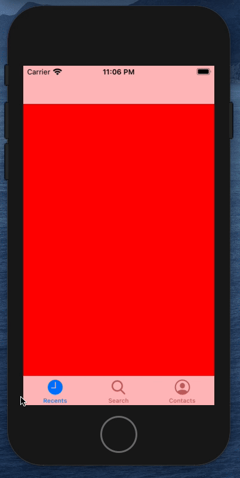

# 🧭 Basic Tab Bar Controller - Hackathon Starter Project



> TL;DR Use tabs to navigate your app.  Have a hackthon idea? Fork this and build something cool!

This project was inspired by a few hackathon designs I've seen this year while mentoring for [Cal Hacks](https://calhacks.io/).  The tab bar design pattern is used to quickly navigate between controllers.

## Interactions
* **Tap the tabs** - *Navigate Away* 🚀

## Getting Started

1. ✅  Fork the Project
2. ✅  Build + Run 
3. ✅  Tap!

## Try it Yourself

```swift
class FirstViewController: UIViewController {
    
    override func viewDidLoad() {
        super.viewDidLoad()
        // TODO: Programmatic add whatever, views, tables, collections, blah
    }
    
}


```

## Help Improve This Project!

* **Add Documentation** - for publc classes/methods.  See [Swift Documentation](https://nshipster.com/swift-documentation/)
* **Create an App** - show me what you can make with my start project!

## Prerequisites

* Xcode 12.0+

## Authors

* **Alex Takahashi** - *Initial work* - [alextakahashi](https://github.com/alextakahashi)

## Acknowledgments

* [README-Template](https://gist.github.com/PurpleBooth/109311bb0361f32d87a2)

## Liability
I am not a lawyer, but **no guarantees if this breaks, totally not responsible if things go to shit - don't sue me**, kthx.  Add *MIT License*.
